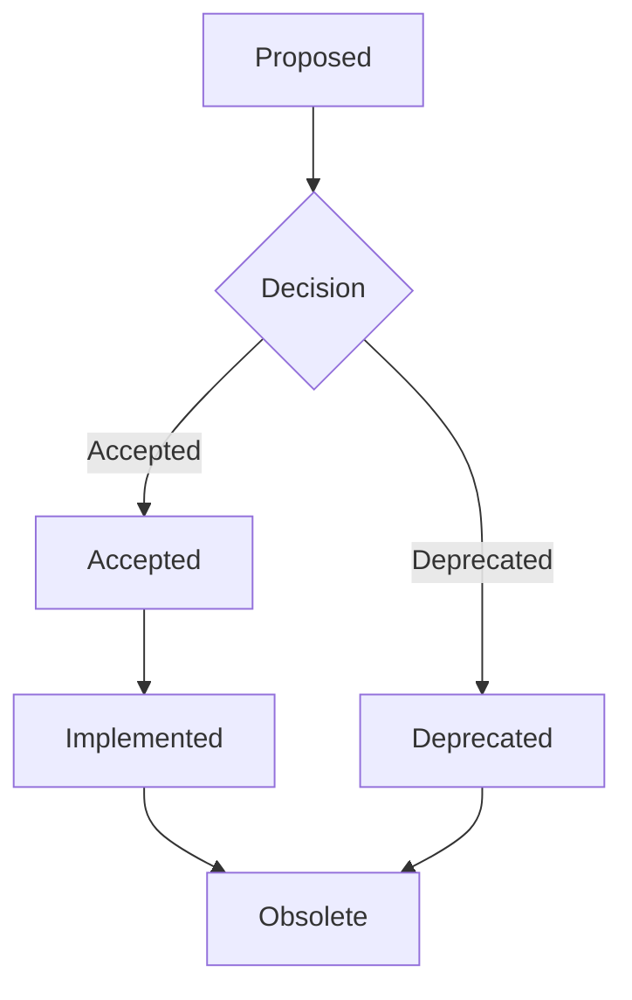

# ADR Template

> This template is based on the Michael Nygard template and the Y-Plan format.

## ADR Template (Mermaid)

## Title

[Short noun phrase describing the decision]

## Status

One of: `Proposed`, `Accepted`, `Deprecated`, `Superseded`

> If superseded, include a link to the new ADR in the `Superseded by` field.

## Context

[Describe the issue motivating this decision]

What is the background of this decision? Consider:

- What is the problem you are trying to solve?
- What constraints must be met?
- What is the current state?

## Decision

[Describe the change being proposed/decided]

State the decision that has been made. Use "We will..." or "This architecture will..." sentences.

Examples:

- We will use Azure Kubernetes Service (AKS) as our primary container orchestration platform
- We will store Terraform state in Azure Blob Storage with state locking
- All services will expose health endpoints for load balancer probes

## Consequences

[Describe the resulting context]

What becomes easier or more difficult to do because of this change?

### Positive

- [List positive outcomes]

### Negative

- [List negative outcomes or trade-offs]

### Neutral

- [List items with no direct impact or where impact is yet unknown]

## Options Considered

| Option | Pros | Cons | Decision |
|--------|------|------|----------|
| Option A | List pros | List cons | Why chosen/rejected |
| Option B | List pros | List cons | Why chosen/rejected |

## Notes

[Any additional notes, links to RFCs, Jira tickets, or discussion threads]

## Metadata

- **Date**: YYYY-MM-DD
- **Author**: Name
- **Reviewers**: Names of people who reviewed this ADR
- **Superseded by**: [Link to new ADR if applicable]

---

## Example ADRs

See [0001-use-terraform-as-iac-tool.md](0001-use-terraform-as-iac-tool.md) for an example.
